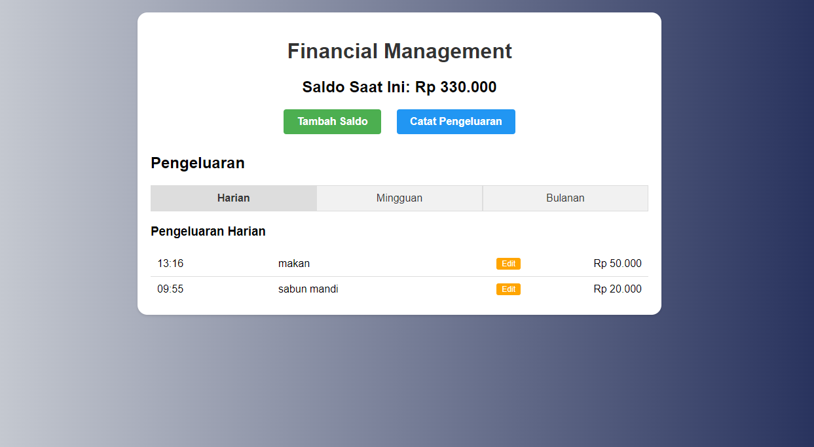

# Financial Management App

Aplikasi web sederhana untuk manajemen keuangan pribadi yang memungkinkan pengguna untuk mencatat pemasukan dan pengeluaran serta melihat riwayatnya berdasarkan periode waktu.



## Fitur

- Mencatat pemasukan (saldo)
- Mencatat pengeluaran dengan keterangan
- Melihat saldo saat ini
- Melihat riwayat pengeluaran:
  - Harian
  - Mingguan
  - Bulanan
- Edit keterangan pengeluaran

## Teknologi yang Digunakan

- PHP
- SQLite3
- HTML
- CSS

## Persyaratan Sistem

- PHP 7.4 atau lebih tinggi
- SQLite3 extension untuk PHP
- Web server (Apache, Nginx, dll)

## Instalasi

1. Clone repository ini:
```bash
git clone https://github.com/yourusername/financial-management.git
```

2. Pastikan web server Anda dapat mengakses folder proyek

3. Pastikan folder proyek dan file database (`financial.db`) memiliki permission yang sesuai:
```bash
chmod 755 /path/to/project
chmod 777 /path/to/project/financial.db
```

4. Akses aplikasi melalui web browser:
```
http://localhost/path/to/project
```

## Struktur Proyek

```
financial-management/
├── functions.php     # File berisi fungsi-fungsi utama
├── index.php         # Halaman utama aplikasi
├── style.css         # File CSS untuk styling
├── tambah-saldo.php  # Halaman untuk menambah saldo
├── tambah-pengeluaran.php  # Halaman untuk mencatat pengeluaran
├── edit-pengeluaran.php    # Halaman untuk mengedit keterangan pengeluaran
├── financial.db      # File database SQLite
└── README.md         # Dokumentasi proyek
```

## Penggunaan

1. Buka halaman utama aplikasi
2. Untuk menambah saldo, klik tombol "Tambah Saldo"
3. Untuk mencatat pengeluaran, klik tombol "Catat Pengeluaran"
4. Lihat riwayat pengeluaran dengan memilih tab Harian, Mingguan, atau Bulanan
5. Untuk mengedit keterangan pengeluaran, klik tombol "Edit" di samping keterangan pada tab Harian

## Keamanan

- Aplikasi ini menggunakan prepared statements untuk mencegah SQL injection
- Input dari pengguna di-sanitize untuk mencegah XSS
- Validasi input dilakukan di sisi server

## Keterbatasan

- Aplikasi ini dirancang untuk penggunaan pribadi dan belum memiliki sistem login
- Tidak ada fitur backup otomatis untuk database


## Kontribusi

Kontribusi selalu diterima! Kamu bisa bantu berkontribusi untuk membuat aplikasi ini menjadi lebih baik:

1. Fork repository ini
2. Buat branch baru (`git checkout -b fitur-baru`)
3. Commit perubahan Anda (`git commit -m 'Menambahkan fitur baru'`)
4. Push ke branch (`git push origin fitur-baru`)
5. Buat Pull Request

## Lisensi

Proyek ini dilisensikan di bawah [MIT License](https://opensource.org/licenses/MIT).

## Kontak

Jika Anda memiliki pertanyaan atau saran, silakan buka issue di repository GitHub ini.

---

Dibuat dengan ❤️ oleh [Nama Anda]